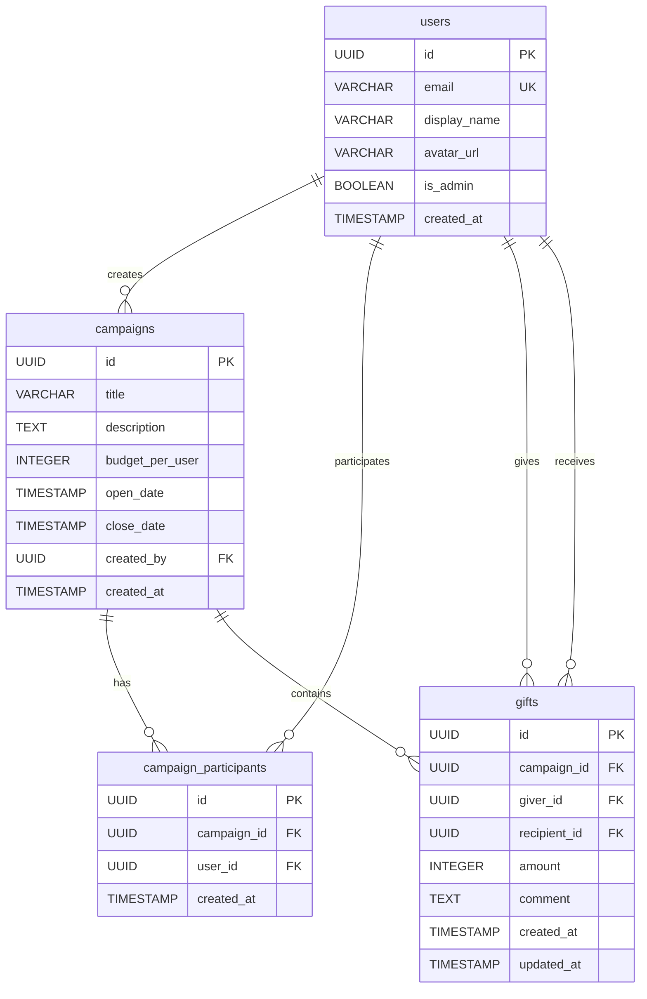

# Bonus Gifting Application — Design Document

**Date:** 2026-02-14
**Status:** Approved

## Overview

A web application where employees gift bonus dollars to coworkers during time-limited campaigns. Each user receives a uniform budget per campaign and distributes it as they choose. Gifts are anonymous to recipients. Admins manage campaigns, import users, and view summary reports.

## Decisions

| Decision | Choice | Rationale |
|----------|--------|-----------|
| Authentication | SSO / OAuth (Google or Microsoft) | Workplace app — users already have corporate identity |
| User management | Admin uploads CSV | Controlled roster, no self-registration |
| Budget model | Same for all participants in a campaign | Simple and fair |
| Gift editing | Full edit/delete before close date | Flexibility for users |
| Gift visibility | Anonymous to recipients | Recipients see amount + comment, not the giver |
| Reports | Summary stats only | Participation rate, totals, averages |
| Scale | 50–500 users | Medium; no extreme optimization needed |

## Tech Stack

| Layer | Technology |
|-------|-----------|
| Frontend | Next.js (App Router) + Tailwind CSS + shadcn/ui |
| API | Express.js (TypeScript) |
| ORM | Prisma |
| Database | PostgreSQL |
| Auth | OAuth 2.0 (Google/Microsoft) with JWT sessions |
| Monorepo | pnpm workspaces |
| Local dev | Docker Compose (Postgres) |

## Database Schema

### Tables

**users**
| Column | Type | Notes |
|--------|------|-------|
| id | UUID | PK |
| email | VARCHAR | Unique, from CSV/SSO |
| display_name | VARCHAR | |
| avatar_url | VARCHAR | Nullable |
| is_admin | BOOLEAN | Default false |
| created_at | TIMESTAMP | |

**campaigns**
| Column | Type | Notes |
|--------|------|-------|
| id | UUID | PK |
| title | VARCHAR | |
| description | TEXT | Nullable |
| budget_per_user | INTEGER | In cents |
| open_date | TIMESTAMP | |
| close_date | TIMESTAMP | |
| created_by | UUID | FK → users |
| created_at | TIMESTAMP | |

**campaign_participants**
| Column | Type | Notes |
|--------|------|-------|
| id | UUID | PK |
| campaign_id | UUID | FK → campaigns |
| user_id | UUID | FK → users |
| created_at | TIMESTAMP | |

Unique constraint: `(campaign_id, user_id)`

**gifts**
| Column | Type | Notes |
|--------|------|-------|
| id | UUID | PK |
| campaign_id | UUID | FK → campaigns |
| giver_id | UUID | FK → users |
| recipient_id | UUID | FK → users |
| amount | INTEGER | In cents |
| comment | TEXT | |
| created_at | TIMESTAMP | |
| updated_at | TIMESTAMP | |

Unique constraint: `(campaign_id, giver_id, recipient_id)`

### ER Diagram (Mermaid)



## API Specification

Base path: `/api/v1`
All endpoints require `Authorization: Bearer <jwt>` except auth routes.

### Authentication

| Method | Path | Description |
|--------|------|-------------|
| GET | `/auth/login` | Redirects to OAuth provider |
| GET | `/auth/callback` | Handles OAuth callback, sets JWT |
| GET | `/auth/me` | Returns current user profile |

### Campaigns

| Method | Path | Auth | Description |
|--------|------|------|-------------|
| GET | `/campaigns` | User | List campaigns user participates in |
| POST | `/campaigns` | Admin | Create a new campaign |
| GET | `/campaigns/:id` | User | Campaign details + user's remaining budget |
| GET | `/campaigns/:id/status` | Admin | Participation stats, budget usage per user |

**POST /campaigns request body:**
```json
{
  "title": "Q4 2026 Bonuses",
  "description": "Year-end appreciation gifts",
  "budget_per_user": 50000,
  "open_date": "2026-12-01T00:00:00Z",
  "close_date": "2026-12-31T23:59:59Z"
}
```

### Participants

| Method | Path | Auth | Description |
|--------|------|------|-------------|
| POST | `/campaigns/:id/participants/import` | Admin | Upload CSV to add participants |
| GET | `/campaigns/:id/participants` | User | List participants (coworker picker) |

**CSV format:** `email,display_name`

### Gifts

| Method | Path | Auth | Description |
|--------|------|------|-------------|
| GET | `/campaigns/:id/gifts` | User | List gifts I've given |
| POST | `/campaigns/:id/gifts` | User | Create a gift |
| PUT | `/campaigns/:id/gifts/:gift_id` | User | Update amount/comment |
| DELETE | `/campaigns/:id/gifts/:gift_id` | User | Delete a gift |
| GET | `/campaigns/:id/gifts/received` | User | Gifts received (anonymous) |

**POST /campaigns/:id/gifts request body:**
```json
{
  "recipient_id": "uuid",
  "amount": 5000,
  "comment": "Thanks for your help on the project!"
}
```

**Business rules enforced on all gift writes:**
- Campaign must be open (current time between open_date and close_date)
- User must be a participant
- Total gifts given must not exceed budget_per_user
- Cannot gift to self

### Reports

| Method | Path | Auth | Description |
|--------|------|------|-------------|
| GET | `/campaigns/:id/reports/summary` | Admin | Summary statistics |

**Response:**
```json
{
  "total_participants": 150,
  "participants_who_gifted": 120,
  "participation_rate": 0.8,
  "total_amount_gifted": 4500000,
  "average_gift_amount": 3750,
  "total_gifts_count": 1200
}
```

## Frontend Pages

### Login
- Single "Sign in with Google/Microsoft" button
- Clean, branded design

### Dashboard (`/`)
- Campaign cards showing: title, remaining budget (progress bar), gifts given count, deadline
- Warm color palette, gift-themed icons

### Gifting Page (`/campaigns/:id`)
- **Budget meter** at top — animated bar showing remaining balance
- **Coworker picker** (left panel) — searchable list with avatars, checkmarks on gifted coworkers
- **Gift form** (right panel) — amount input, comment textarea, submit button
- **My gifts** below — cards for each gift with edit/delete, gift-box icons
- **Confetti animation** on gift submission

### Received Gifts (`/campaigns/:id/received`)
- Anonymous gift cards with amount and comment
- Reveal animation on first view

### Admin (`/admin`)
- **Create campaign** — form with title, description, dates, budget, CSV upload
- **Campaign status** — progress ring chart for participation, per-user budget usage table

### Visual Design
- Warm, celebratory color palette (not corporate blue)
- Gift-box and confetti iconography
- Animated transitions and toast notifications
- Responsive for tablet and desktop

## Project Structure

```
contributor-example/
├── docker-compose.yml
├── packages/
│   ├── api/
│   │   ├── src/
│   │   │   ├── routes/
│   │   │   ├── middleware/
│   │   │   ├── services/
│   │   │   └── index.ts
│   │   ├── prisma/
│   │   │   └── schema.prisma
│   │   ├── package.json
│   │   └── tsconfig.json
│   └── web/
│       ├── src/
│       │   ├── app/
│       │   ├── components/
│       │   ├── hooks/
│       │   └── lib/
│       ├── package.json
│       └── next.config.js
├── docs/
│   ├── api-spec.yaml
│   ├── schema-diagram.md
│   └── local-setup.md
└── package.json
```

## Implementation Tasks

| Task ID | Subject | Blocked By |
|---------|---------|------------|
| 4 | Set up project scaffolding and Docker Compose | — |
| 1 | Implement database schema and Prisma migrations | 4 |
| 5 | Create API spec and DB schema diagram documentation | 1 |
| 2 | Implement Express API layer with all endpoints | 1, 4 |
| 3 | Build Next.js frontend with all pages and components | 2, 4 |

**Implementation order:** 4 → 1 → 5 (parallel with 2) → 2 → 3
