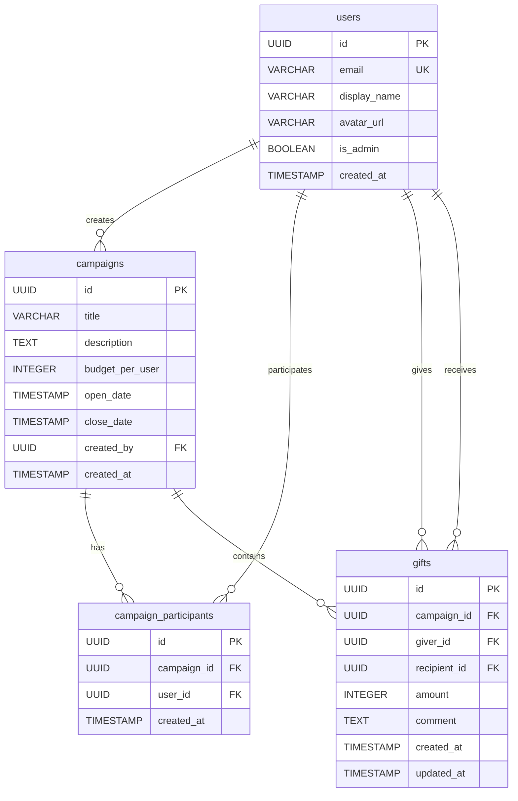

# Database Schema

## ER Diagram

## Key Constraints

- **campaign_participants**: Unique on `(campaign_id, user_id)` — a user can only join a campaign once
- **gifts**: Unique on `(campaign_id, giver_id, recipient_id)` — one gift per recipient per campaign
- All monetary amounts stored in **cents** (integer) to avoid floating-point issues
- UUIDs used for all primary keys
